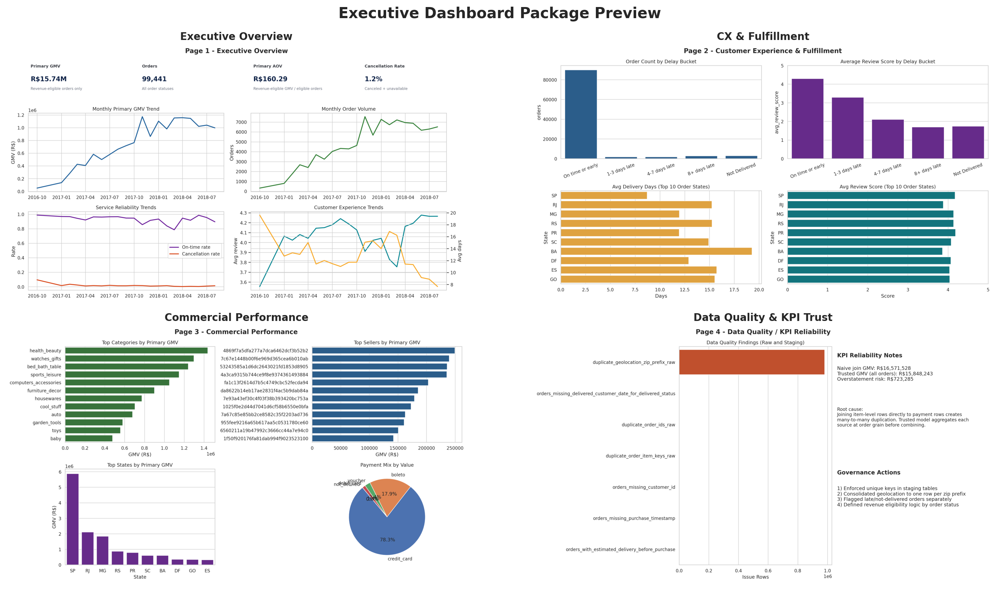
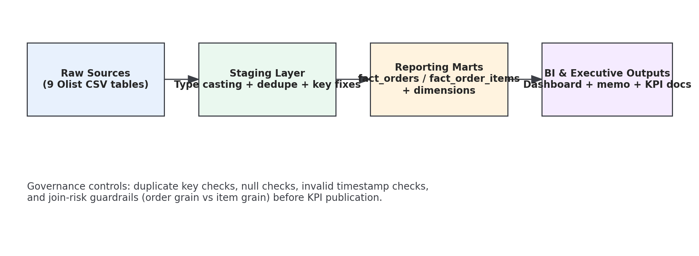

# Olist Executive Reporting Layer
### Consulting-style BI and KPI Governance Case (Allen Xu)

Portfolio project for data consulting / BI interviews, designed to mimic a client engagement:

> Before: fragmented, manual, high-risk reporting  
> After: trusted reporting layer + KPI governance + executive dashboard package



---

## Why this project is relevant to consulting analytics work

This repository demonstrates the exact workstream a consulting analytics team delivers:

1. **Assess data environment risk** (nulls, duplicates, join grain mismatch, timestamp quality)
2. **Centralize into a trusted reporting layer** (fact/dim model with business-ready metrics)
3. **Implement KPI governance** (data contracts and publication gating)
4. **Deliver executive BI outputs** (dashboard pages + memo + implementation docs)
5. **Translate data into decisions** (operational and commercial recommendations)

---

## Business objective

Build a centralized analytics layer for leadership visibility into:
- sales and order trends
- fulfillment reliability
- customer experience impact
- commercial concentration and risk

Primary dataset is the **real public Olist e-commerce dataset** (no synthetic transaction generation).

---

## KPI Governance and Metric Trust

### Primary commercial KPI convention

- **Primary Revenue KPI:** `gmv_revenue_eligible`
- **Definition:** sum of GMV only where `is_revenue_eligible_order = 1`
- **Reason:** canceled/unavailable orders are operational outcomes, not realized commercial value

### Transparency companion

- `gmv_all_orders` is also exported for QA transparency and variance analysis, but is **not** the executive commercial headline KPI.

### Primary AOV definition

- `aov_revenue_eligible = gmv_revenue_eligible / revenue_eligible_orders`

### Governance controls

- 17 automated data contract tests
- Critical failures block KPI publication
- Test outputs:
  - `data/processed/data_contract_test_results.csv`
  - `data/processed/data_contract_test_summary.csv`
  - `docs/data_contract_test_report.md`

---

## Current executive KPI snapshot (from `kpi_headline.csv`)

- **Total orders (all statuses):** 99,441
- **Revenue-eligible orders:** 98,199
- **Primary GMV (`gmv_revenue_eligible`):** **R$15.74M**
- **GMV all-orders reference:** R$15.85M
- **Primary AOV:** **R$160.29**
- **Cancellation rate:** 1.24%
- **Average review score:** 4.09 / 5
- **On-time delivery rate:** 91.9%
- **Top-10 seller concentration share:** 12.85% of primary GMV

---

## Decision-oriented top insights

1. **Protect customer experience via delivery SLA interventions:**  
   review scores drop sharply as delays increase (on-time vs late gap is material).
2. **Prioritize regional fulfillment fixes where delivery times are structurally slower:**  
   directly impacts satisfaction and likely repeat behavior.
3. **Manage seller dependency risk proactively:**  
   top sellers account for a meaningful share of monetized GMV.
4. **Treat cancellation rate as a weekly control metric, not only a monthly post-mortem KPI.**
5. **Use revenue-eligible KPI definitions in leadership reporting to avoid overstatement bias.**

---

## Architecture and workflow



Pipeline:
1. Download raw Olist CSVs
2. Run staging transforms (typing, dedupe, key normalization)
3. Build marts (`fact_orders`, `fact_order_items`, dimensions)
4. Export KPI tables
5. Run data contract tests
6. Generate dashboard assets (PNG + PDF)

---

## Repository structure (key assets)

```text
/
├── .github/workflows/pipeline_smoke_test.yml
├── Makefile
├── requirements.txt
├── sql/
│   ├── 01_schema.sql
│   ├── 02_staging.sql
│   ├── 03_marts.sql
│   └── 04_business_queries.sql
├── python/
│   ├── download_olist_data.py
│   ├── build_reporting_layer.py
│   ├── run_data_contract_tests.py
│   ├── run_pipeline.py
│   └── generate_dashboard_assets.py
├── data/processed/
│   ├── kpi_headline.csv
│   ├── kpi_monthly.csv
│   ├── kpi_weekly_ops.csv
│   ├── kpi_seller_concentration.csv
│   ├── data_contract_test_results.csv
│   └── data_contract_test_summary.csv
├── dashboard/
│   ├── dashboard_export.pdf
│   ├── powerbi_layout_guide.md
│   ├── powerbi/
│   │   ├── README.md
│   │   └── measure_definitions.md
│   └── screenshots/
│       ├── dashboard_collage.png
│       ├── page_1_executive_overview.png
│       ├── page_2_customer_fulfillment.png
│       ├── page_3_commercial_performance.png
│       └── page_4_data_quality_reliability.png
└── docs/
    ├── executive_summary.md
    ├── data_dictionary.md
    ├── metric_definitions.md
    ├── metric_caveats.md
    ├── qa_framework.md
    ├── data_contract_test_report.md
    └── freshness_sla_placeholder.md
```

---

## Dashboard package

- Page 1: Executive Overview
- Page 2: Customer Experience & Fulfillment
- Page 3: Commercial Performance
- Page 4: Data Quality / KPI Reliability

Power BI rebuild documentation:
- `dashboard/powerbi_layout_guide.md`
- `dashboard/powerbi/README.md`
- `dashboard/powerbi/measure_definitions.md`

---

## Reproducibility

```bash
# Install pinned dependencies
python3 -m pip install -r requirements.txt

# End-to-end run
python3 python/run_pipeline.py

# Faster rerun (reuse existing raw files)
python3 python/run_pipeline.py --skip-download

# Makefile shortcuts
make pipeline
make pipeline-fast
```

CI smoke test (`.github/workflows/pipeline_smoke_test.yml`) validates:
- download/build/tests
- dashboard asset generation
- required artifact presence
- rerun behavior with `--skip-download`

---

## Limitations

1. **No cost / returns / margin inputs** in source data, so profitability KPIs are out of scope.
2. **Static exported dashboard assets** are included in repo; native `.pbix` is documented but not committed.
3. Customer sentiment is proxied by review score and may not capture all support-channel feedback.

---

## Repo metadata suggestions

- **Suggested repo description:**  
  `Consulting-style Olist BI case: trusted reporting marts, KPI governance tests, executive dashboard, and business recommendations.`
- **Suggested GitHub topics:**  
  `data-analytics`, `business-intelligence`, `duckdb`, `sql`, `power-bi`, `data-quality`, `kpi`, `dashboard`, `consulting`, `portfolio-project`
- **Suggested release tag:**  
  `v1.0.0-consulting-deliverable`