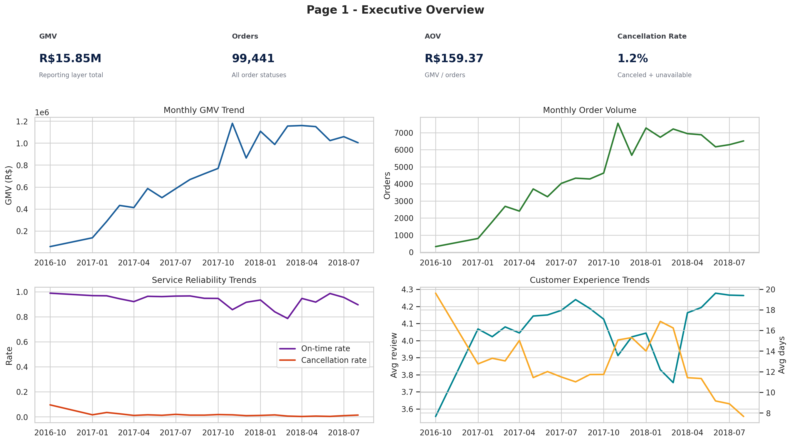
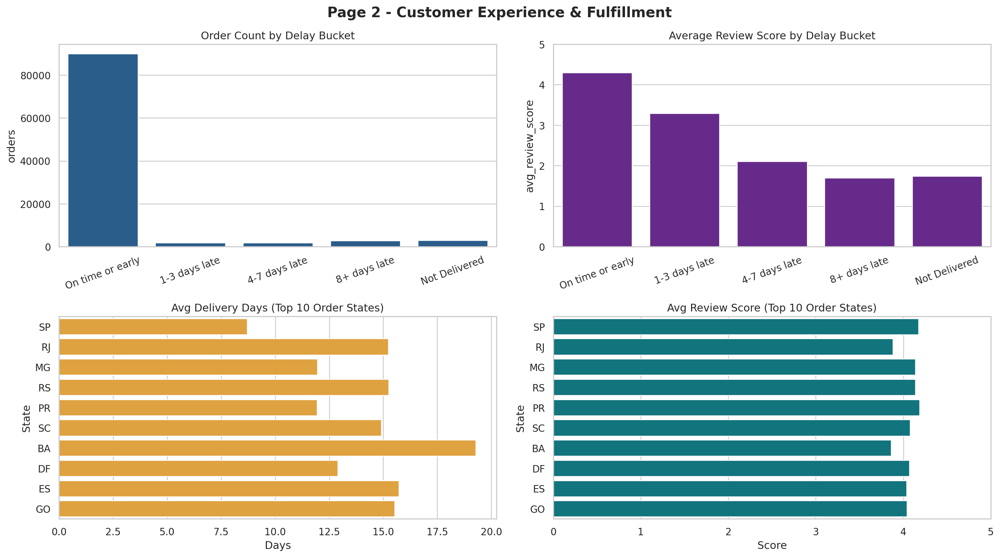
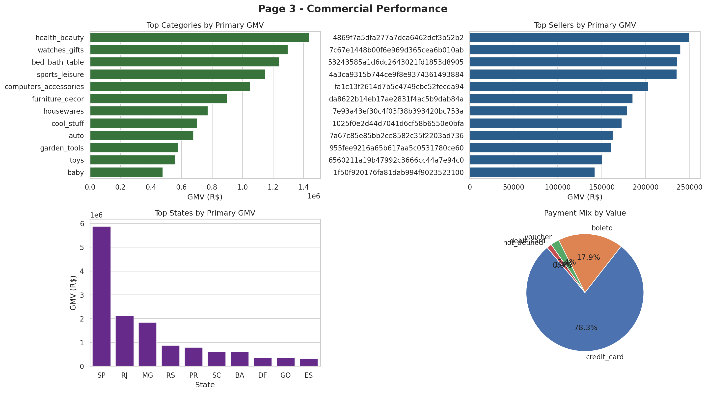
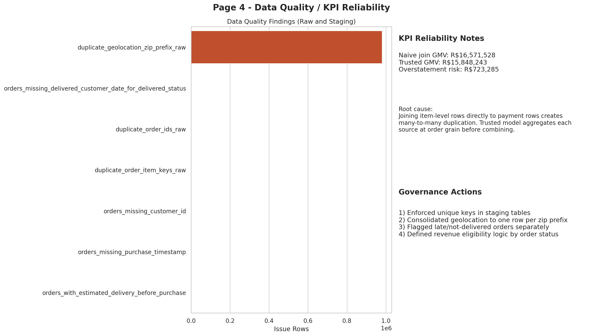

# Olist Executive Reporting Layer  
### Consulting-Style Analytics Project for Data Analyst / BI Roles

**Author:** Allen Xu  
**Project Type:** End-to-end analytics consulting engagement (data audit -> reporting layer -> executive dashboards -> recommendations)

---

## Project Objective

This project simulates a client engagement for a PE-backed / growth-stage commerce business:

> "Leadership has data in many places, but reporting is slow, inconsistent, and hard to trust. Build a centralized analytics layer and dashboard that gives decision-makers visibility into sales, fulfillment, customer experience, and operational performance."

The deliverable is designed to demonstrate the exact skill mix expected in a consulting analytics or data analyst role:
- ad hoc analysis
- KPI design
- data quality validation
- dimensional modeling
- dashboard storytelling
- business-facing recommendations

---

## Why This Fits a Data Consulting Role

This repository shows how to:
1. Assess messy source data and identify KPI-risk issues.
2. Consolidate multiple transactional tables into a trusted reporting model.
3. Build executive-ready KPI views and visual summaries.
4. Translate metrics into management actions (not just charts).

---

## Dataset Overview (Real Public Data)

Primary source: **Olist Brazilian E-Commerce Public Dataset** (official public mirror).  
Tables used:
- orders
- order items
- customers
- products
- sellers
- payments
- reviews
- geolocation
- category translation

Raw files are downloaded via:

```bash
python3 python/download_olist_data.py
```

---

## Final Repository Structure

```text
/
├── .github/
│   └── workflows/
│       └── pipeline_smoke_test.yml
├── Makefile
├── README.md
├── requirements.txt
├── data/
│   ├── raw/
│   │   ├── .gitkeep
│   │   └── README.md
│   └── processed/
│       ├── .gitkeep
│       ├── README.md
│       ├── kpi_headline.csv
│       ├── kpi_monthly.csv
│       ├── kpi_weekly_ops.csv
│       ├── kpi_active_customers_monthly.csv
│       ├── kpi_customer_cohort_retention.csv
│       ├── kpi_category_performance.csv
│       ├── kpi_seller_performance.csv
│       ├── kpi_seller_operational_risk.csv
│       ├── kpi_state_performance.csv
│       ├── kpi_payment_mix.csv
│       ├── kpi_delay_vs_reviews.csv
│       ├── data_quality_summary.csv
│       ├── data_contract_test_results.csv
│       ├── data_contract_test_summary.csv
│       ├── kpi_join_risk_demo.csv
│       └── model_row_counts.csv
├── sql/
│   ├── 01_schema.sql
│   ├── 02_staging.sql
│   ├── 03_marts.sql
│   └── 04_business_queries.sql
├── python/
│   ├── download_olist_data.py
│   ├── build_reporting_layer.py
│   ├── run_data_contract_tests.py
│   ├── run_pipeline.py
│   ├── generate_dashboard_assets.py
│   ├── data_quality_audit.ipynb
│   └── optional_etl_or_validation.ipynb
├── dashboard/
│   ├── dashboard_export.pdf
│   ├── powerbi_layout_guide.md
│   └── screenshots/
│       ├── page_1_executive_overview.png
│       ├── page_2_customer_fulfillment.png
│       ├── page_3_commercial_performance.png
│       └── page_4_data_quality_reliability.png
└── docs/
    ├── executive_summary.md
    ├── data_dictionary.md
    ├── metric_definitions.md
    ├── qa_framework.md
    ├── data_contract_test_report.md
    └── architecture_diagram.png
```

---

## Implementation Plan (Consulting Workplan)

1. **Assess data environment**  
   Profile source tables, key health, timestamp integrity, and join risks.
2. **Build trusted reporting layer**  
   Create staging transformations and marts with explicit grain control.
3. **Define KPI contracts**  
   Document business-friendly metric definitions and caveats.
4. **Develop executive dashboards**  
   Build 4-page KPI story (overview, fulfillment, commercial, data quality).
5. **Translate into actions**  
   Deliver executive memo with recommendations and ongoing monitoring plan.

---

## Architecture / Workflow


### Workflow
1. **Raw ingestion** from official Olist public dataset CSVs.
2. **Staging transformations** for type casting, deduping, and key normalization.
3. **Reporting marts**:
   - `fact_orders`
   - `fact_order_items`
   - `dim_customers`
   - `dim_products`
   - `dim_sellers`
   - `dim_dates`
   - `dim_geography`
4. **Business queries + KPI exports** for dashboards and memo.
5. **Executive dashboard pages** and PDF export.

---

## Key Data Quality Findings (and Fixes)

### Major risks identified
- **Geolocation join explosion risk:** 981,148 duplicate zip-prefix rows in raw geolocation.
- **Join-grain mismatch risk:** naive item+payment joins overstate GMV by **R$723K**.
- **Delivery completeness gap:** 8 delivered orders missing delivered-customer timestamp.

### Mitigations implemented
- Consolidated geolocation to one row per zip prefix (`stg_geolocation_zip`).
- Aggregated item/payment/review tables before joining into `fact_orders`.
- Added explicit KPI flags:
  - `is_canceled_or_unavailable`
  - `is_revenue_eligible_order`
  - `is_on_time_delivery`
- Added automated data contract tests (9 checks) with publication-gating outputs.

---

## QA & Governance Automation

The project includes an automated KPI governance layer:

- **Script:** `python/run_data_contract_tests.py`
- **Checks:** PK/FK integrity, GMV reconciliation, KPI sanity bands, and service-quality signal directionality
- **Generated artifacts:**
  - `data/processed/data_contract_test_results.csv`
  - `data/processed/data_contract_test_summary.csv`
  - `docs/data_contract_test_report.md`
- **Governance rule:** critical failures block KPI publication

CI smoke test is included in `.github/workflows/pipeline_smoke_test.yml`.

---

## Data Model Overview

### Facts
- `marts.fact_orders` (order grain, executive KPI base)
- `marts.fact_order_items` (item grain, commercial deep dives)

### Dimensions
- `marts.dim_customers`
- `marts.dim_products`
- `marts.dim_sellers`
- `marts.dim_dates`
- `marts.dim_geography`

This separation prevents duplicated metrics and supports both high-level and drill-down analysis.

---

## Executive Dashboard Pages

### Page 1 - Executive Overview


### Page 2 - Customer Experience & Fulfillment


### Page 3 - Commercial Performance


### Page 4 - Data Quality / KPI Reliability


---

## Top Business Insights

- **GMV:** R$15.85M across 99,441 orders.
- **AOV:** R$159.37.
- **On-time delivery rate:** 91.9%; late deliveries materially depress review score.
- **CX impact of delays:** On-time orders average 4.29 review score vs 1.70 for 8+ days late.
- **Payment concentration:** Credit card accounts for 78.3% of payment value.
- **Retention opportunity:** repeat customer rate is ~3.1%.
- **Operational monitoring upgrade:** weekly KPI trend + seller operational risk views + cohort retention outputs.

---

## Tools Used

- **SQL / Modeling:** DuckDB
- **Python:** pandas, numpy, matplotlib, seaborn, requests
- **Notebooks:** Jupyter
- **Dashboard Output:** Executive PNG pages + PDF export

---

## How to Reproduce Locally

```bash
# 1) Install dependencies
python3 -m pip install -r requirements.txt

# 2) Download real public source data
python3 python/download_olist_data.py

# 3) Build staging + marts and export KPI tables
python3 python/build_reporting_layer.py

# 4) Run data contract tests
python3 python/run_data_contract_tests.py

# 5) Generate dashboard screenshots, PDF, architecture diagram
python3 python/generate_dashboard_assets.py

# One-command pipeline (download + build + QA + dashboard)
python3 python/run_pipeline.py

# Faster local rerun when raw data already exists
python3 python/run_pipeline.py --skip-download

# Makefile shortcuts
make pipeline
make pipeline-fast
```

Optional exploration:
- `python/data_quality_audit.ipynb`
- `python/optional_etl_or_validation.ipynb`
- `dashboard/powerbi_layout_guide.md` (visual-to-business-question mapping for Power BI build)
- `docs/qa_framework.md` (consulting-style KPI governance framework)

---

## Future Improvements

1. Rebuild visuals in native Power BI with drill-through and row-level filters.
2. Add margin/profitability metrics if COGS and returns data is available.
3. Add freshness SLA monitoring and anomaly alert hooks.
4. Add customer LTV/profitability analysis once contribution margin data is available.

---

## Project Deliverables for Hiring Review

- Trusted reporting layer with documented assumptions
- Executive dashboard package (4 pages + PDF)
- Data quality audit notebook
- KPI definition and data dictionary documentation
- Business-oriented executive memo with recommendations